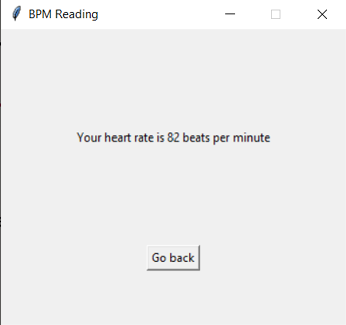

# Live Heart Monitor
 #### Prepared by:
 Fadi Adel Dawoud
900163212

## Project Overview
Metallic electrodes attached to the AD8232 were utilized to generate an analog electrical signal that maps electric pulses from the heart. If plotted over time, this signal will produce the family heartbeat waveform, examples of which are shown in figure one depending on the positioning of the electrodes.

The analog signal is consumed by the STM Black Pill (STM32F103C8) microcontroller. The microcontroller is connected to a PC application over serial link and offers a serial interface of one of three commands:

1. Setting sampling rate Returning live values of the input analog
2. signal in real time for 60 seconds Computing and returning the
3. instantaneous heart rate in beats per minute (bpm)

The PC application controlling the microcontroller offers a customizable serial interface and a graphical user interface (GUI) to facilitate connecting serially to the microcontroller, sending commands and displaying the outputs.

## Build and Run Instructions
#### Requirements: 
- Python, with matplotlib, numpy, tkinter and pySerial
- Black Pill Microcontroller (STM32F103C8) and an FTDI Cable / any other UART-USB interfacing component
- AD8232 ECG Conditioning Circuit with electrodes

#### Circuit Connections:
- Connect USART 1 TX/RX to a computer COM port using the FTDI cable / its alternative
- Connect AD8232 to the electrodes and attach them to a patient's body using one of these configurations:  
  
- Connect the output pin of the AD8232 to the A0 pin of the Black Pill. 
- The circuit should look like:   
  

#### Building and Running:
- Perform all circuit connections instructions
- Flash your Black Pill using the provided hex file / Keil uVision project (found at ```HeartMonitorEmbedded/MDK-ARM/HeartMonitorEmbedded/HeartMonitorEmbedded.hex```)
- In the main directory, run ```python monitor.py```

#### Runtime Instructions: 
- The initial screen allows you to choose the COM port and baud rate. The hex file baud rate is 115200 bits/s. (```ConnectionScreen.py```)  
  
  
- The main screen opens afterwards, where you can set the sampling rate by modifying the field and clicking the first button. A confirmation message or an error message are displayed. (```CommandScreen.py```)  
 
  
- The second buttons opens a new screen where live readings are reported for sixty seconds (```ContinuousGraphScreen.py```)  
 
  
- The third button opens a new screen displaying the instantaneous heart rate (```BpmReading.py```)  
  

#### For more information regarding the implementation of the commands and their behavior underneath the hood, refer to the project report (```Final Report.docx```), the section on System Operation
